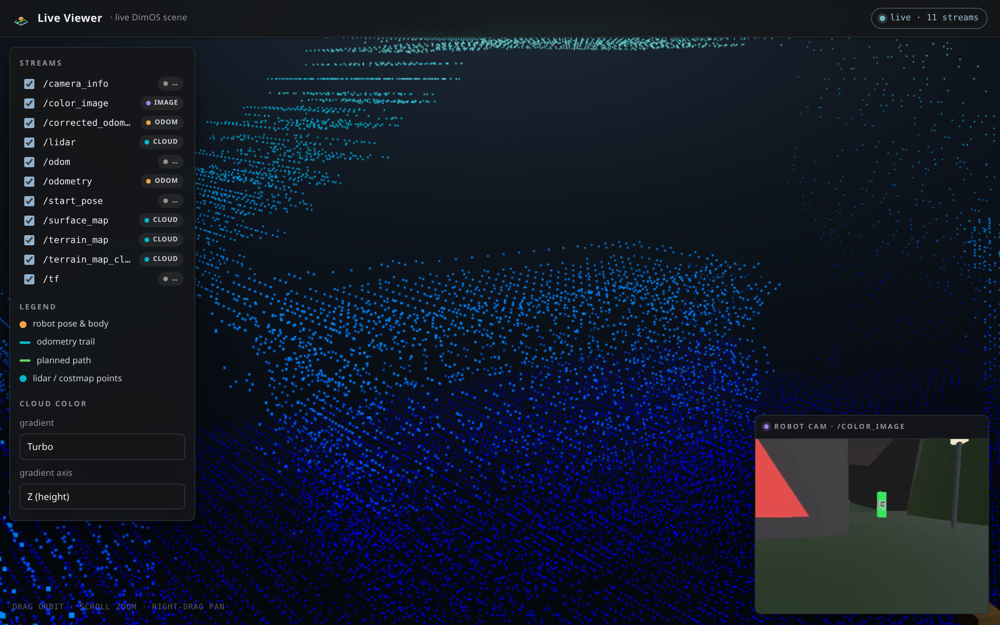
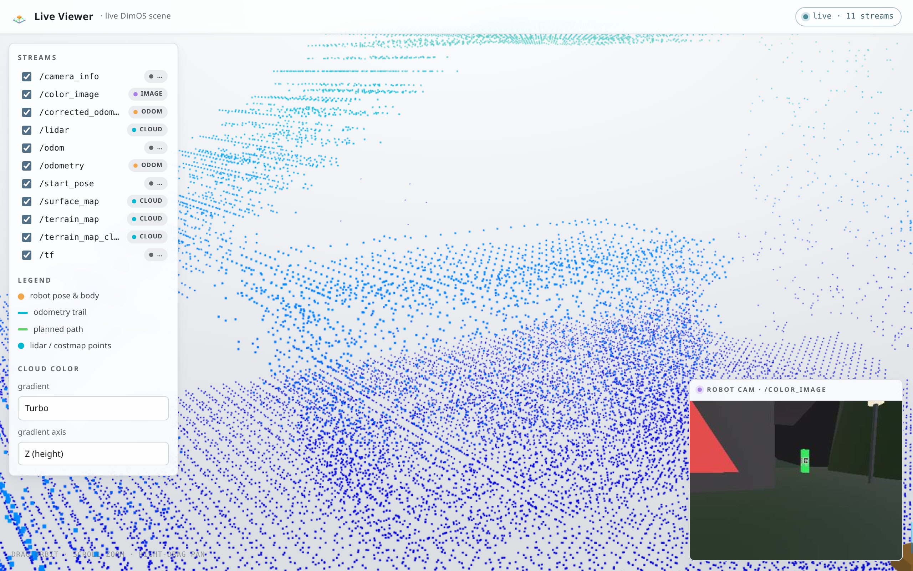
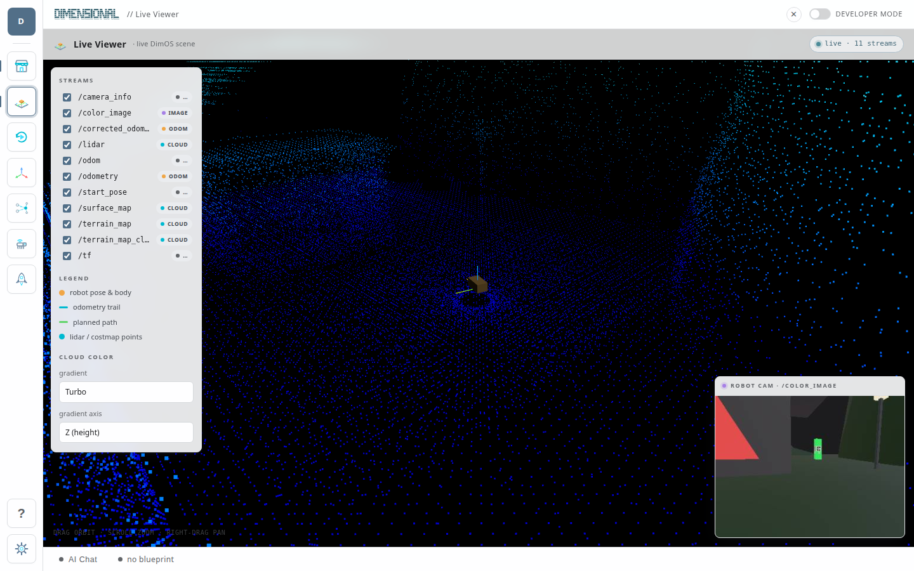

# dim-live-viewer

A [DimOS dashboard](https://github.com/jeff-hykin/dim-app) app that renders a
**live 3D scene** of a running DimOS stack — the way the PimSim frontend does,
but fed by live data off the DimOS bridge (works with the sim *or* a real robot).

- **Robot** — body + pose gizmo + odometry trail.
- **Point clouds** — lidar, terrain, costmap, PGO pose-graph nodes (TF-placed,
  height-gradient colored).
- **Planned path** and pose-graph edges.
- **First-person camera** — a picture-in-picture of the robot's color camera.

Everything is **discovered dynamically**: the app subscribes to every stream on
the bridge and decides how to draw each one by *duck-typing the decoded message*
— there is no hardcoded list of topic names. Streams are placed in a common
world frame via the live `/tf` tree (each cloud is transformed by its own
`header.frame_id`). The UI follows the desktop's light/dark theme.

| Dark | Light |
| --- | --- |
|  |  |

Running as an app in the DimOS desktop:



## dimOS Desktop

```sh
dimos-desktop install https://github.com/jeff-hykin/dim-live-viewer --ref dimos-desktop2
```

Then open **Live Viewer** from the rail while a dimos blueprint (sim, replay or robot) runs on zenoh —
its topics appear as they start flowing.

## How it works

`dim/apps/live_viewer/frontend/index.html` is the whole app: a [three.js](https://threejs.org) scene
(ROS Z-up) fed straight from Desktop's [zenoh-web](https://github.com/jeff-hykin/zenoh-web) bridge at
`/zenoh-web`. It lists the `dimos/**` topics every few seconds and picks how to draw each from the
message type in its key (`dimos/<topic>/<msg_name>`):

- `sensor_msgs.Image` / `CompressedImage` — the bridge's `dimos-image` / `dimos-compressed-image`
  codecs (an H.264 video track); topics named `*depth*` use the lossless `dimos-depth` codecs instead.
- `sensor_msgs.PointCloud2` — the `dimos-pointcloud2` codec (quantized points), placed by its
  `frame_id` through the live tf tree.
- `PoseStamped`, `Odometry`, `TFMessage`, `Path` — raw, decoded in the page with
  [`@dimos/msgs`](https://jsr.io/@dimos/msgs).

No build step, no backend.

## License

Apache-2.0 — see [LICENSE](LICENSE).
